# DocOS — Phase 2 Comprehensive Database Schema & Entity Relationships

This document contains the complete database design for **DocOS Phase 2**, incorporating:
- ASP.NET Core Identity & Full RBAC
- Multi-Tenant Clinic Management
- Dual-Track Subscription Plans & Quota Metering
- Master Data-Driven Catalogs & Observations (Vitals, Labs, Complaints, Advice)
- Multi-Doctor Practice & Segregated OPD Queues
- Prescriptions & 500+ Indian Drug Formulary
- Audit Logging & Compliance

---

## 1. Complete Entity Relationship Diagram (Mermaid)

```mermaid
erDiagram
    %% ==========================================
    %% IDENTITY & RBAC
    %% ==========================================
    AspNetUsers {
        string Id PK
        string UserName
        string Email
        string FullName
        guid ClinicId FK "null for PlatformAdmin"
        string Qualifications "MBBS, MD"
        string MedicalCouncilRegNo
        string HprId "ABDM Doctor ID"
        string Speciality
        decimal ConsultationFee
        bool IsActive
        datetime CreatedAt
    }

    AspNetRoles {
        string Id PK
        string Name "PlatformAdmin, SalesAgent, ClinicAdmin, Doctor, Nurse, Receptionist"
        string NormalizedName
    }

    AspNetUserRoles {
        string UserId PK, FK
        string RoleId PK, FK
    }

    AspNetRoleClaims {
        int Id PK
        string RoleId FK
        string ClaimType "Permission"
        string ClaimValue "Prescription.Write"
    }

    AspNetUserClaims {
        int Id PK
        string UserId FK
        string ClaimType
        string ClaimValue
    }

    AspNetUserTokens {
        string UserId PK, FK
        string LoginProvider
        string Name "PasswordResetToken, 2FA"
        string Value
    }

    %% ==========================================
    %% MULTI-TENANT CLINIC CORE
    %% ==========================================
    Clinics {
        guid Id PK
        string Name "Clinic Trade Name"
        string Subdomain "e.g. careclinic"
        string Phone
        string Address
        string Status "Trial, Active, Suspended"
        int MaxDoctorsAllowed
        string HfrId "ABDM Facility ID"
        bool EnableAbdmIntegration "Configurable toggle"
        string OnboardedByUserId FK "Sales Rep attribution"
        string SalesNotes
        int PrintTopMarginMm "0-120mm offset"
        int PrintBottomMarginMm
        bool HideLetterheadOnPrint
        datetime CreatedAt
    }

    %% ==========================================
    %% SUBSCRIPTION & USAGE METERING
    %% ==========================================
    SubscriptionPlanMaster {
        guid Id PK
        string PlanCode "STARTER_500, MULTI_DOC_UNLIMITED"
        string PlanName
        string Tier "Starter, MultiDoctor, Enterprise"
        bool IsUnlimitedVisits
        int DefaultMonthlyVisits "null if unlimited"
        int MaxDoctors
        int MaxStaff
        decimal PriceINR
        string BillingCycle "Monthly, Annual"
        bool HasCustomVitals
        bool HasLabModule
        bool HasAbdmIntegration
        bool IsActive
    }

    ClinicSubscription {
        guid Id PK
        guid ClinicId FK
        guid PlanId FK
        bool IsUnlimitedVisits "SaaS Owner Override"
        int MonthlyVisitQuota "SaaS Owner Custom Quota"
        int AdditionalTopUpVisits "Top-up blocks (+250, +500, +1000)"
        string Status "Trial, Active, GracePeriod, QuotaExceeded, Suspended"
        datetime CurrentPeriodStart
        datetime CurrentPeriodEnd
        int GracePeriodDays
    }

    ClinicMonthlyUsage {
        guid Id PK
        guid ClinicId FK
        string YearMonth "e.g. 2026-10"
        int VisitsConducted "Real-time Rx/Visit counter"
        datetime LastVisitRecordedAt
    }

    SubscriptionPaymentHistory {
        guid Id PK
        guid ClinicId FK
        guid SubscriptionId FK
        string InvoiceNumber "INV-2026-0042"
        decimal Amount
        string PaymentMethod "UPI, Card, Cash, Cheque"
        string TransactionReference "Bank UTR / Gateway ID"
        datetime PaymentDate
        string Status "Success, Pending, Failed"
    }

    %% ==========================================
    %% MASTER DATA & CLINICAL CATALOGS
    %% ==========================================
    VitalMaster {
        guid Id PK
        guid ClinicId FK "null = Global, non-null = Custom"
        string Code "BP_SYS, PULSE, SUGAR_F, BMI"
        string DisplayName
        string Unit "mmHg, bpm, degF, mg/dL"
        string InputType "Number, Decimal, Select"
        decimal NormalRangeMin
        decimal NormalRangeMax
        int DefaultDisplayOrder
        bool IsActive
    }

    ClinicVitalPreference {
        guid Id PK
        guid ClinicId FK
        guid VitalMasterId FK
        bool IsEnabled "Clinic toggle"
        bool IsMandatory
        int DisplayOrder "Drag-drop triage order"
    }

    VisitVitals {
        guid Id PK
        guid VisitId FK
        guid PatientId FK
        guid VitalMasterId FK
        string Value "e.g. 120, 98.6"
        string UnitSnapshot "mmHg"
        bool IsAbnormal
        datetime RecordedAt
        string RecordedByUserId FK
    }

    LabTestMaster {
        guid Id PK
        guid ClinicId FK "null = Global"
        string TestCode "CBC, HBA1C, LIPID"
        string TestName
        string Category "Biochemistry, Hematology"
        string SampleType "Blood, Urine"
        bool FastingRequired
        bool IsActive
    }

    ComplaintMaster {
        guid Id PK
        guid ClinicId FK "null = Global"
        string ComplaintText "Fever, Cough, Headache"
        string DefaultDurationChips "['x 2 days', 'x 1 week']"
        bool IsActive
    }

    VisitComplaints {
        guid Id PK
        guid VisitId FK
        guid ComplaintMasterId FK
        string ComplaintText
        string Duration "e.g. 3 Days"
        string Severity "Mild, Moderate, Severe"
    }

    AdviceTemplateMaster {
        guid Id PK
        guid ClinicId FK "null = Global"
        string Category "Diet, Post-Op, General"
        string Title
        string InstructionsText
        bool IsActive
    }

    %% ==========================================
    %% PATIENTS & ENCOUNTERS (MULTI-DOCTOR)
    %% ==========================================
    Patients {
        guid Id PK
        guid ClinicId FK
        string PatientUid "DOC-2026-0001"
        string FullName
        string MobileNumber "10-digit Indian Mobile"
        int Age
        datetime DateOfBirth
        string Gender "Male, Female, Other"
        string BloodGroup "O+, B+"
        string AbhaNumber "ABDM 14-digit ID"
        string AbhaAddress "patient@abdm"
        bool IsAbhaVerified
        string Allergies "Drug allergy alert banner"
        string Address
        datetime CreatedAt
    }

    Visits {
        guid Id PK
        guid ClinicId FK
        guid PatientId FK
        string DoctorId FK "Assigned Consulting Doctor"
        int TokenNumber "Daily token #1, #2..."
        datetime VisitDate
        string Status "Waiting, In-Consultation, Completed"
        string Diagnosis "Clinical Impression"
        string DoctorNotes
        datetime FollowUpDate
        datetime CreatedAt
    }

    %% ==========================================
    %% PRESCRIPTIONS & FORMULARY
    %% ==========================================
    Prescriptions {
        guid Id PK
        guid VisitId FK
        guid ClinicId FK
        guid PatientId FK
        string DoctorId FK "Signing Doctor"
        datetime PrescriptionDate
        string PdfShareToken "WhatsApp / QR Code viewer"
        bool IsSigned
    }

    PrescriptionItems {
        guid Id PK
        guid PrescriptionId FK
        guid MedicineId FK
        string MedicineName "Brand name e.g. Augmentin 625"
        string GenericName "Amoxicillin + Clavulanic Acid"
        string Form "Tablet, Syrup, Drops"
        string Dosage "1-0-1, SOS, STAT"
        string Timing "After Food, Before Food"
        string Duration "5 Days, 2 Weeks"
        string Instructions "Take with warm water"
        int DisplayOrder
    }

    PrescriptionLabOrders {
        guid Id PK
        guid PrescriptionId FK
        guid LabTestMasterId FK
        string SpecialInstructions
    }

    PrescriptionAdvice {
        guid Id PK
        guid PrescriptionId FK
        string AdviceText
    }

    Medicines {
        guid Id PK
        guid ClinicId FK "null = 500+ Indian Formulary"
        string BrandName "Dolo 650, Pan-D"
        string GenericName "Paracetamol 650mg"
        string Form "Tablet, Capsule"
        string Strength "650mg"
        string DefaultDosage "1-0-1"
        string DefaultTiming "After Food"
        bool IsDoctorFavorite
    }

    %% ==========================================
    %% AUDIT
    %% ==========================================
    AuditLogs {
        guid Id PK
        guid ClinicId FK "null = Platform action"
        string UserId FK
        string Action "CREATE, UPDATE, DELETE, VIEW"
        string EntityName "Prescription, Visit"
        string EntityId
        datetime Timestamp
        string IpAddress
        string ChangesJson
    }

    %% ==========================================
    %% RELATIONSHIPS
    %% ==========================================
    Clinics ||--o{ AspNetUsers : "employs staff"
    Clinics ||--o{ Patients : "registers"
    Clinics ||--o{ Visits : "manages queue"
    Clinics ||--o{ ClinicSubscription : "holds subscription"
    Clinics ||--o{ ClinicMonthlyUsage : "tracks usage"
    Clinics ||--o{ SubscriptionPaymentHistory : "invoiced"
    Clinics ||--o{ ClinicVitalPreference : "configures vitals"
    Clinics ||--o{ AuditLogs : "audit trail"

    AspNetUsers ||--o{ AspNetUserRoles : "assigned roles"
    AspNetRoles ||--o{ AspNetUserRoles : "maps to"
    AspNetRoles ||--o{ AspNetRoleClaims : "has permissions"
    AspNetUsers ||--o{ AspNetUserClaims : "has claims"
    AspNetUsers ||--o{ AspNetUserTokens : "issues tokens"

    SubscriptionPlanMaster ||--o{ ClinicSubscription : "template for"

    Patients ||--o{ Visits : "attends"
    AspNetUsers ||--o{ Visits : "consults as doctor"
    Visits ||--o| Prescriptions : "generates"
    Visits ||--o{ VisitVitals : "records vitals"
    Visits ||--o{ VisitComplaints : "records complaints"

    VitalMaster ||--o{ ClinicVitalPreference : "overrides"
    VitalMaster ||--o{ VisitVitals : "categorizes"
    ComplaintMaster ||--o{ VisitComplaints : "standardizes"

    AspNetUsers ||--o{ Prescriptions : "signed by doctor"
    Prescriptions ||--o{ PrescriptionItems : "prescribes"
    Medicines ||--o{ PrescriptionItems : "formulary link"
    Prescriptions ||--o{ PrescriptionLabOrders : "orders tests"
    LabTestMaster ||--o{ PrescriptionLabOrders : "categorizes"
    Prescriptions ||--o{ PrescriptionAdvice : "advises"
```

---

## 2. Identity & RBAC Domain

### 2.1 `AspNetUsers` (`ApplicationUser`)
Represents all users: Platform Super Admins, Clinic Owners, Doctors, Nurses, and Receptionists.

| Column | Type | Nullable | Constraints / Default | Description |
| :--- | :--- | :---: | :--- | :--- |
| `Id` | `string` / `varchar(450)` | No | PK (UUID string) | Unique User Identifier |
| `UserName` | `string` / `varchar(256)` | No | Unique index | Typically user email |
| `Email` | `string` / `varchar(256)` | No | Index | Login email address |
| `FullName` | `string` / `varchar(150)` | No | — | Doctor or Staff full legal name |
| `ClinicId` | `Guid` | **Yes** | FK &rarr; `Clinics(Id)` | **`null` for PlatformAdmin**; assigned for clinic staff |
| `Qualifications` | `string` / `varchar(200)` | Yes | — | e.g. "MBBS, MD (Medicine)" (Doctor specific) |
| `MedicalCouncilRegNo`| `string` / `varchar(100)`| Yes | — | e.g. "MCI-2018-87451" (Doctor specific) |
| `HprId` | `string` / `varchar(100)`| Yes | — | Healthcare Professional Registry ID (ABDM) |
| `Speciality` | `string` / `varchar(100)` | Yes | — | e.g. "General Physician", "Pediatrics" |
| `ConsultationFee` | `decimal(10,2)` | Yes | `0.00` | Default consultation fee charged by doctor |
| `IsActive` | `bool` | No | `true` | Allows deactivating staff without deleting records |
| `CreatedAt` | `DateTime` | No | `UtcNow` | Account creation timestamp |
| `PasswordHash` | `string` | Yes | — | ASP.NET Identity hashed password |
| `SecurityStamp` | `string` | Yes | — | Token invalidation stamp |

### 2.2 `AspNetRoles` (`IdentityRole`)
Stores system role definitions.

| Column | Type | Nullable | Constraints / Default | Description |
| :--- | :--- | :---: | :--- | :--- |
| `Id` | `string` / `varchar(450)` | No | PK | Role Identifier |
| `Name` | `string` / `varchar(256)` | No | Unique | `PlatformAdmin`, `SalesAgent`, `ClinicAdmin`, `Doctor`, `Nurse`, `Receptionist` |
| `NormalizedName` | `string` / `varchar(256)` | No | Unique index | UPPERCASE normalized name |

### 2.3 `AspNetUserRoles` (`IdentityUserRole<string>`)
Many-to-many relationship mapping users to roles (allows a user to be both `ClinicAdmin` and `Doctor`).

| Column | Type | Nullable | Constraints / Default | Description |
| :--- | :--- | :---: | :--- | :--- |
| `UserId` | `string` / `varchar(450)` | No | PK, FK &rarr; `AspNetUsers(Id)` | User identifier |
| `RoleId` | `string` / `varchar(450)` | No | PK, FK &rarr; `AspNetRoles(Id)` | Role identifier |

### 2.4 Supporting Identity Tables
* **`AspNetRoleClaims`**: `Id`, `RoleId` (FK), `ClaimType`, `ClaimValue` (Fine-grained role permissions, e.g. `Permission: "Prescription.Write"`).
* **`AspNetUserClaims`**: `Id`, `UserId` (FK), `ClaimType`, `ClaimValue` (User-specific permission overrides).
* **`AspNetUserLogins`**: `LoginProvider`, `ProviderKey`, `UserId` (FK) (Reserved for "Sign in with Google").
* **`AspNetUserTokens`**: `UserId` (FK), `LoginProvider`, `Name`, `Value` (Password reset tokens, email confirmations, 2FA keys).

---

## 3. Multi-Tenant Core Domain

### 3.1 `Clinics`
Represents independent medical practices or clinic facilities.

| Column | Type | Nullable | Constraints / Default | Description |
| :--- | :--- | :---: | :--- | :--- |
| `Id` | `Guid` | No | PK | Clinic Tenant Identifier |
| `Name` | `string` / `varchar(200)` | No | — | Clinic / Practice Trade Name |
| `Subdomain` | `string` / `varchar(60)` | Yes | Unique index | e.g. "careclinic" for `careclinic.docos.in` |
| `Phone` | `string` / `varchar(20)` | No | — | Official clinic contact number |
| `Address` | `string` / `varchar(500)` | Yes | — | Physical clinic address |
| `ClinicTimings` | `string` / `varchar(200)` | Yes | — | e.g. "Mon-Sat: 10:00 AM - 08:00 PM" |
| `Status` | `string` / `varchar(30)` | No | `'Trial'` | `'Trial'`, `'Active'`, `'Suspended'`, `'Deactivated'` |
| `MaxDoctorsAllowed` | `int` | No | `1` | Max concurrent doctors allowed by active subscription |
| `HfrId` | `string` / `varchar(100)`| Yes | — | Health Facility Registry ID (ABDM Clinic ID) |
| `EnableAbdmIntegration`| `bool` | No | `true` | Configurable ABDM toggle per clinic |
| `OnboardedByUserId` | `string` / `varchar(450)`| Yes | FK &rarr; `AspNetUsers(Id)`| Field sales rep / agent who onboarded this clinic |
| `SalesNotes` | `string` / `varchar(500)`| Yes | — | Notes on deal terms, clinic software replaced |
| `LogoUrl` | `string` / `varchar(500)` | Yes | — | Header logo for blank paper print |
| `PrintTopMarginMm` | `int` | No | `0` | Offset (0-120mm) for physical letterhead pads |
| `PrintBottomMarginMm`| `int` | No | `0` | Bottom margin offset for stationery |
| `HideLetterheadOnPrint`| `bool`| No | `false` | Default print mode (false = Blank A4, true = Pad) |
| `CreatedAt` | `DateTime` | No | `UtcNow` | Onboarding timestamp |

---

## 4. Subscriptions, Metering & Billing Domain

### 4.1 `SubscriptionPlanMaster`
Catalog of subscription packages managed by `PlatformAdmin`.

| Column | Type | Nullable | Constraints / Default | Description |
| :--- | :--- | :---: | :--- | :--- |
| `Id` | `Guid` | No | PK | Plan Identifier |
| `PlanCode` | `string` / `varchar(50)` | No | Unique index | e.g. `"STARTER_500"`, `"MULTI_DOC_UNLIMITED"` |
| `PlanName` | `string` / `varchar(150)`| No | — | Public display title |
| `Tier` | `string` / `varchar(50)` | No | — | `'Starter'`, `'MultiDoctor'`, `'Enterprise'` |
| `IsUnlimitedVisits` | `bool` | No | `false` | True if unmetered; false if capped |
| `DefaultMonthlyVisits`| `int` | Yes | — | e.g. `250`, `500`, `1000` (null if unlimited) |
| `MaxDoctors` | `int` | No | `1` | Number of doctor accounts permitted |
| `MaxStaff` | `int` | No | `2` | Number of receptionist/nurse accounts permitted |
| `PriceINR` | `decimal(10,2)` | No | `0.00` | Package price in INR |
| `BillingCycle` | `string` / `varchar(30)` | No | `'Monthly'` | `'Monthly'`, `'Quarterly'`, `'Annual'` |
| `HasCustomVitals` | `bool` | No | `true` | Feature flag |
| `HasLabModule` | `bool` | No | `true` | Feature flag |
| `HasAbdmIntegration` | `bool` | No | `true` | Universal ABDM feature flag for all tiers |
| `IsActive` | `bool` | No | `true` | Offered for new signups/upgrades |

### 4.2 `ClinicSubscription`
The active plan and discretionary quotas for a specific clinic.

| Column | Type | Nullable | Constraints / Default | Description |
| :--- | :--- | :---: | :--- | :--- |
| `Id` | `Guid` | No | PK | Subscription Record ID |
| `ClinicId` | `Guid` | No | Unique FK &rarr; `Clinics(Id)` | Enforces one active subscription per clinic |
| `PlanId` | `Guid` | No | FK &rarr; `SubscriptionPlanMaster(Id)` | Base plan template |
| `IsUnlimitedVisits` | `bool` | No | `false` | **SaaS Owner override** to make visits unlimited |
| `MonthlyVisitQuota` | `int` | Yes | — | **SaaS Owner custom override** (e.g. 750 visits) |
| `AdditionalTopUpVisits`| `int` | No | `0` | Extra visits purchased in blocks (+250, +500, +1000) |
| `Status` | `string` / `varchar(30)` | No | `'Active'` | `'Trial'`, `'Active'`, `'GracePeriod'`, `'QuotaExceeded'`, `'Suspended'` |
| `CurrentPeriodStart`| `DateTime` | No | — | Current billing cycle start |
| `CurrentPeriodEnd` | `DateTime` | No | — | Current billing cycle renewal / expiration date |
| `GracePeriodDays` | `int` | No | `5` | Buffer days before hard suspension |
| `Notes` | `string` / `varchar(500)`| Yes | — | Internal notes from Super Admin |

### 4.3 `ClinicMonthlyUsage`
Real-time usage counter per billing cycle.

| Column | Type | Nullable | Constraints / Default | Description |
| :--- | :--- | :---: | :--- | :--- |
| `Id` | `Guid` | No | PK | Counter ID |
| `ClinicId` | `Guid` | No | FK &rarr; `Clinics(Id)` | Tenant ID |
| `YearMonth` | `string` / `varchar(7)` | No | — | e.g. `"2026-10"`, `"2026-11"` |
| `VisitsConducted` | `int` | No | `0` | Increments upon consultation completion |
| `LastVisitRecordedAt`| `DateTime`| Yes | — | Timestamp of latest consultation |

*Composite Unique Index*: `(ClinicId, YearMonth)`

### 4.4 `SubscriptionPaymentHistory`
Billing invoices and payment tracking.

| Column | Type | Nullable | Constraints / Default | Description |
| :--- | :--- | :---: | :--- | :--- |
| `Id` | `Guid` | No | PK | Invoice / Payment ID |
| `ClinicId` | `Guid` | No | FK &rarr; `Clinics(Id)` | Tenant ID |
| `SubscriptionId` | `Guid` | No | FK &rarr; `ClinicSubscription(Id)` | Associated subscription |
| `InvoiceNumber` | `string` / `varchar(50)` | No | Unique index | e.g. `"INV-2026-0042"` |
| `Amount` | `decimal(10,2)` | No | — | Total payment amount in INR |
| `PaymentMethod` | `string` / `varchar(50)` | No | — | `'UPI'`, `'Card'`, `'NetBanking'`, `'Cash'`, `'Cheque'` |
| `TransactionReference`| `string` / `varchar(100)`| Yes | — | Bank UTR or Gateway Transaction ID |
| `PaymentDate` | `DateTime` | No | `UtcNow` | Payment receipt date |
| `Status` | `string` / `varchar(30)` | No | `'Success'` | `'Success'`, `'Pending'`, `'Failed'` |

---

## 5. Master Data-Driven Catalogs & Observations Domain

### 5.1 `VitalMaster` (Observation Definitions)
Global standard catalogue of vitals, with optional clinic custom extensions.

| Column | Type | Nullable | Constraints / Default | Description |
| :--- | :--- | :---: | :--- | :--- |
| `Id` | `Guid` | No | PK | Vital Identifier |
| `ClinicId` | `Guid` | **Yes** | FK &rarr; `Clinics(Id)` | **`null` = Global standard**; non-null = Clinic Custom Vital |
| `Code` | `string` / `varchar(50)` | No | — | e.g. `"BP_SYS"`, `"PULSE"`, `"SUGAR_F"`, `"PEFR"` |
| `DisplayName` | `string` / `varchar(100)`| No | — | e.g. "Blood Pressure (Systolic)", "Fasting Sugar" |
| `Unit` | `string` / `varchar(30)` | No | — | e.g. `"mmHg"`, `"bpm"`, `"°F"`, `"mg/dL"`, `"cm"` |
| `InputType` | `string` / `varchar(30)` | No | `'Number'` | `'Number'`, `'Decimal'`, `'Text'`, `'Select'` |
| `NormalRangeMin` | `decimal(8,2)` | Yes | — | Low physiological reference cutoff |
| `NormalRangeMax` | `decimal(8,2)` | Yes | — | High physiological reference cutoff |
| `DefaultDisplayOrder`| `int` | No | `0` | Global visual sorting order |
| `IsActive` | `bool` | No | `true` | System active flag |

### 5.2 `ClinicVitalPreference` (Clinic Overrides)
Controls which vitals are active, mandatory, and their display order for each specific clinic.

| Column | Type | Nullable | Constraints / Default | Description |
| :--- | :--- | :---: | :--- | :--- |
| `Id` | `Guid` | No | PK | Preference ID |
| `ClinicId` | `Guid` | No | FK &rarr; `Clinics(Id)` | Tenant ID |
| `VitalMasterId` | `Guid` | No | FK &rarr; `VitalMaster(Id)` | Vital definition |
| `IsEnabled` | `bool` | No | `true` | Active toggle for this clinic |
| `IsMandatory` | `bool` | No | `false` | Required before doctor intake |
| `DisplayOrder` | `int` | No | `0` | Visual order on receptionist intake modal |

*Composite Unique Index*: `(ClinicId, VitalMasterId)`

### 5.3 `VisitVitals` (Transactional Observations)
Records actual measured vital observations per patient visit.

| Column | Type | Nullable | Constraints / Default | Description |
| :--- | :--- | :---: | :--- | :--- |
| `Id` | `Guid` | No | PK | Observation ID |
| `VisitId` | `Guid` | No | FK &rarr; `Visits(Id)` | Associated OPD visit |
| `PatientId` | `Guid` | No | FK &rarr; `Patients(Id)` | Patient ID |
| `VitalMasterId` | `Guid` | No | FK &rarr; `VitalMaster(Id)` | Which vital was recorded |
| `Value` | `string` / `varchar(50)` | No | — | Measured reading (e.g. "120", "98.6") |
| `UnitSnapshot` | `string` / `varchar(30)` | No | — | Immutable unit at time of recording |
| `IsAbnormal` | `bool` | No | `false` | Pre-evaluated based on reference ranges |
| `RecordedAt` | `DateTime` | No | `UtcNow` | Measurement timestamp |
| `RecordedByUserId`| `string` / `varchar(450)`| Yes | FK &rarr; `AspNetUsers(Id)`| Staff who took the measurement |

### 5.4 `LabTestMaster` (Diagnostic Tests Catalog)
Standard pathology & radiology test master.

| Column | Type | Nullable | Constraints / Default | Description |
| :--- | :--- | :---: | :--- | :--- |
| `Id` | `Guid` | No | PK | Test ID |
| `ClinicId` | `Guid` | **Yes** | FK &rarr; `Clinics(Id)` | `null` = Global test; non-null = Clinic test |
| `TestCode` | `string` / `varchar(50)` | No | — | e.g. `"CBC"`, `"HBA1C"`, `"LIPID"`, `"CXR"` |
| `TestName` | `string` / `varchar(150)`| No | — | e.g. "Complete Blood Count", "HbA1c Glycated Hemoglobin" |
| `Category` | `string` / `varchar(50)` | No | — | `'Hematology'`, `'Biochemistry'`, `'Microbiology'`, `'Radiology'` |
| `SampleType` | `string` / `varchar(50)` | Yes | — | `'Blood'`, `'Urine'`, `'Serum'`, `'None'` |
| `FastingRequired` | `bool` | No | `false` | e.g. 10-12 hours fasting notice |
| `IsActive` | `bool` | No | `true` | Active status |

### 5.5 `ComplaintMaster` & `AdviceTemplateMaster`
* **`ComplaintMaster`**: `Id`, `ClinicId?`, `ComplaintText` (e.g. "Fever", "Headache"), `DefaultDurationChips` (JSON array: `["x 2 days", "x 1 week"]`), `IsActive`.
* **`AdviceTemplateMaster`**: `Id`, `ClinicId?`, `Category` (`"Diet"`, `"Post-Op"`, `"General"`), `Title`, `InstructionsText`, `IsActive`.

---

## 6. Patient & Clinical Encounters Domain (Multi-Doctor)

### 6.1 `Patients`
Master patient demographic record.

| Column | Type | Nullable | Constraints / Default | Description |
| :--- | :--- | :---: | :--- | :--- |
| `Id` | `Guid` | No | PK | Patient UUID |
| `ClinicId` | `Guid` | No | FK &rarr; `Clinics(Id)` | Tenant ID |
| `PatientUid` | `string` / `varchar(50)` | No | — | Clinic-scoped UID (e.g. `"DOC-2026-0001"`) |
| `FullName` | `string` / `varchar(150)`| No | — | Patient's name |
| `MobileNumber` | `string` / `varchar(20)` | No | Index | Indian 10-digit phone |
| `Age` | `int` | Yes | — | Patient age in years |
| `DateOfBirth` | `DateTime` | Yes | — | Optional exact DOB |
| `Gender` | `string` / `varchar(20)` | No | — | `'Male'`, `'Female'`, `'Other'` |
| `BloodGroup` | `string` / `varchar(10)` | Yes | — | e.g. `"O+"`, `"B+"` |
| `AbhaNumber` | `string` / `varchar(17)` | Yes | Index | 14-digit ABHA ID (`XX-XXXX-XXXX-XXXX`) |
| `AbhaAddress` | `string` / `varchar(100)`| Yes | Index | ABDM PHR handle (e.g. `patient@abdm`) |
| `IsAbhaVerified`| `bool` | No | `false` | ABHA OTP/biometric verification status |
| `Allergies` | `string` / `varchar(500)`| Yes | — | **Drug allergies trigger visual alert banner** |
| `Address` | `string` / `varchar(300)`| Yes | — | Residential address |
| `CreatedAt` | `DateTime` | No | `UtcNow` | First registration date |

*Composite Unique Index*: `(ClinicId, PatientUid)`

### 6.2 `Visits` (Daily OPD Queue)
Encapsulates daily check-in, token numbers, and doctor assignment.

| Column | Type | Nullable | Constraints / Default | Description |
| :--- | :--- | :---: | :--- | :--- |
| `Id` | `Guid` | No | PK | Visit ID |
| `ClinicId` | `Guid` | No | FK &rarr; `Clinics(Id)` | Tenant ID |
| `PatientId` | `Guid` | No | FK &rarr; `Patients(Id)` | Patient ID |
| **`DoctorId`** | `string` / `varchar(450)`| **Yes**| FK &rarr; `AspNetUsers(Id)`| **Assigned consulting doctor (Multi-Doctor queues)** |
| `TokenNumber` | `int` | No | — | Daily sequential token (`1`, `2`, `3`...) |
| `VisitDate` | `DateTime` | No | `Today` | Date of OPD visit |
| `Status` | `string` / `varchar(30)` | No | `'Waiting'` | `'Waiting'`, `'In-Consultation'`, `'Completed'`, `'Cancelled'` |
| `Diagnosis` | `string` / `varchar(500)`| Yes | — | Provisional clinical impression |
| `DoctorNotes` | `string` | Yes | — | Examination notes & findings |
| `FollowUpDate` | `DateTime` | Yes | — | Next suggested follow-up |
| `CreatedAt` | `DateTime` | No | `UtcNow` | Check-in timestamp |

*Composite Index*: `(ClinicId, VisitDate, DoctorId)`

---

## 7. Prescriptions & Formulary Domain

### 7.1 `Prescriptions`
Medical prescription generated from an encounter.

| Column | Type | Nullable | Constraints / Default | Description |
| :--- | :--- | :---: | :--- | :--- |
| `Id` | `Guid` | No | PK | Prescription ID |
| `VisitId` | `Guid` | No | Unique FK &rarr; `Visits(Id)` | Associated encounter |
| `ClinicId` | `Guid` | No | FK &rarr; `Clinics(Id)` | Tenant ID |
| `PatientId` | `Guid` | No | FK &rarr; `Patients(Id)` | Patient ID |
| **`DoctorId`** | `string` / `varchar(450)`| No | FK &rarr; `AspNetUsers(Id)`| Consulting doctor who signed the Rx |
| `PrescriptionDate`| `DateTime` | No | `UtcNow` | Date & time generated |
| `PdfShareToken` | `string` / `varchar(100)`| Yes | Unique index | Secure token for WhatsApp / QR code viewing |
| `IsSigned` | `bool` | No | `true` | Digital sign-off flag |

### 7.2 `PrescriptionItems`
Individual medications prescribed.

| Column | Type | Nullable | Constraints / Default | Description |
| :--- | :--- | :---: | :--- | :--- |
| `Id` | `Guid` | No | PK | Rx Item ID |
| `PrescriptionId` | `Guid` | No | FK &rarr; `Prescriptions(Id)`| Parent prescription |
| `MedicineId` | `Guid` | Yes | FK &rarr; `Medicines(Id)` | Linked formulary medicine (if catalog item) |
| `MedicineName` | `string` / `varchar(200)`| No | — | Brand name (e.g. "Augmentin 625") |
| `GenericName` | `string` / `varchar(250)`| Yes | — | Salt composition (e.g. "Amoxicillin + Clavulanic Acid") |
| `Form` | `string` / `varchar(50)` | No | — | `'Tablet'`, `'Capsule'`, `'Syrup'`, `'Injection'`, `'Ointment'` |
| `Dosage` | `string` / `varchar(50)` | No | — | Shorthand: `"1-0-1"`, `"1-0-0"`, `"0-0-1"`, `"SOS"`, `"STAT"` |
| `Timing` | `string` / `varchar(50)` | No | — | `'After Food'`, `'Before Food'`, `'With Food'`, `'At Bedtime'` |
| `Duration` | `string` / `varchar(50)` | No | — | e.g. `"5 Days"`, `"2 Weeks"` |
| `Instructions` | `string` / `varchar(300)`| Yes | — | e.g. "Take with warm water" |
| `DisplayOrder` | `int` | No | `0` | Sort order on printout |

### 7.3 `PrescriptionLabOrders`
Diagnostic tests ordered on the prescription.

| Column | Type | Nullable | Constraints / Default | Description |
| :--- | :--- | :---: | :--- | :--- |
| `Id` | `Guid` | No | PK | Lab Order ID |
| `PrescriptionId` | `Guid` | No | FK &rarr; `Prescriptions(Id)`| Parent prescription |
| `LabTestMasterId`| `Guid` | No | FK &rarr; `LabTestMaster(Id)`| Ordered investigation |
| `SpecialInstructions`| `string` / `varchar(300)`| Yes | — | e.g. "Fasting mandatory, report by evening" |

### 7.4 `PrescriptionAdvice`
Dietary, lifestyle, or follow-up instructions printed on the prescription.

| Column | Type | Nullable | Constraints / Default | Description |
| :--- | :--- | :---: | :--- | :--- |
| `Id` | `Guid` | No | PK | Advice Item ID |
| `PrescriptionId` | `Guid` | No | FK &rarr; `Prescriptions(Id)`| Parent prescription |
| `AdviceText` | `string` / `varchar(500)`| No | — | e.g. "Avoid sugar & carbohydrates", "Saline gargle twice daily" |

### 7.5 `Medicines` (500+ Indian Drug Formulary)
Seeded national generic salts and doctor custom medicines.

| Column | Type | Nullable | Constraints / Default | Description |
| :--- | :--- | :---: | :--- | :--- |
| `Id` | `Guid` | No | PK | Drug ID |
| `ClinicId` | `Guid` | **Yes** | FK &rarr; `Clinics(Id)` | **`null` = Global 500+ Drug Master**; non-null = Clinic custom medicine |
| `BrandName` | `string` / `varchar(200)`| No | Index | Indian trade name (e.g. "Dolo 650", "Pan-D") |
| `GenericName` | `string` / `varchar(300)`| No | Index | Active salt composition (e.g. "Paracetamol 650mg") |
| `Form` | `string` / `varchar(50)` | No | — | `'Tablet'`, `'Syrup'`, `'Capsule'`, etc. |
| `Strength` | `string` / `varchar(100)`| Yes | — | e.g. "650mg", "40mg" |
| `DefaultDosage` | `string` / `varchar(50)` | Yes | — | Default shorthand (e.g. "1-0-1") |
| `DefaultTiming` | `string` / `varchar(50)` | Yes | — | Default meal timing |
| `IsDoctorFavorite`| `bool` | No | `false` | Fast 1-click prescribing star |

---

## 8. Audit & Compliance Domain

### 8.1 `AuditLogs`
Immutable audit trail tracking clinical and tenant security actions (ABDM readiness).

| Column | Type | Nullable | Constraints / Default | Description |
| :--- | :--- | :---: | :--- | :--- |
| `Id` | `Guid` | No | PK | Audit Record ID |
| `ClinicId` | `Guid` | **Yes** | FK &rarr; `Clinics(Id)` | `null` for platform-level actions; non-null for clinic |
| `UserId` | `string` / `varchar(450)`| Yes | FK &rarr; `AspNetUsers(Id)`| User who performed the action |
| `Action` | `string` / `varchar(50)` | No | — | `'CREATE'`, `'UPDATE'`, `'DELETE'`, `'VIEW'`, `'LOGIN'` |
| `EntityName` | `string` / `varchar(100)`| No | — | e.g. `"Prescription"`, `"Visit"`, `"ClinicSubscription"` |
| `EntityId` | `string` / `varchar(100)`| No | — | Primary key of modified entity |
| `Timestamp` | `DateTime` | No | `UtcNow` | Action occurrence timestamp |
| `IpAddress` | `string` / `varchar(50)` | Yes | — | Client IP address |
| `ChangesJson` | `string` | Yes | — | Serialized JSON delta of before/after state |

---

## 9. Provider Compatibility Notes (SQL Server & PostgreSQL)

Because we are utilizing the **Dual Database Provider Factory Pattern**:
* **Guids / UUIDs**:
  * PostgreSQL: Native `uuid` type.
  * SQL Server: Native `uniqueidentifier` type (`NEWSEQUENTIALID()`).
* **Date & Times**:
  * PostgreSQL: `timestamptz` (`timestamp with time zone`).
  * SQL Server: `datetime2`.
* **Strings**:
  * PostgreSQL: `varchar(n)` / `text`.
  * SQL Server: `nvarchar(n)` / `nvarchar(max)` (supports multilingual Indian patient names).
* **Decimals**:
  * Exact precision `decimal(10,2)` or `decimal(8,2)` mapped identically across both engines.
