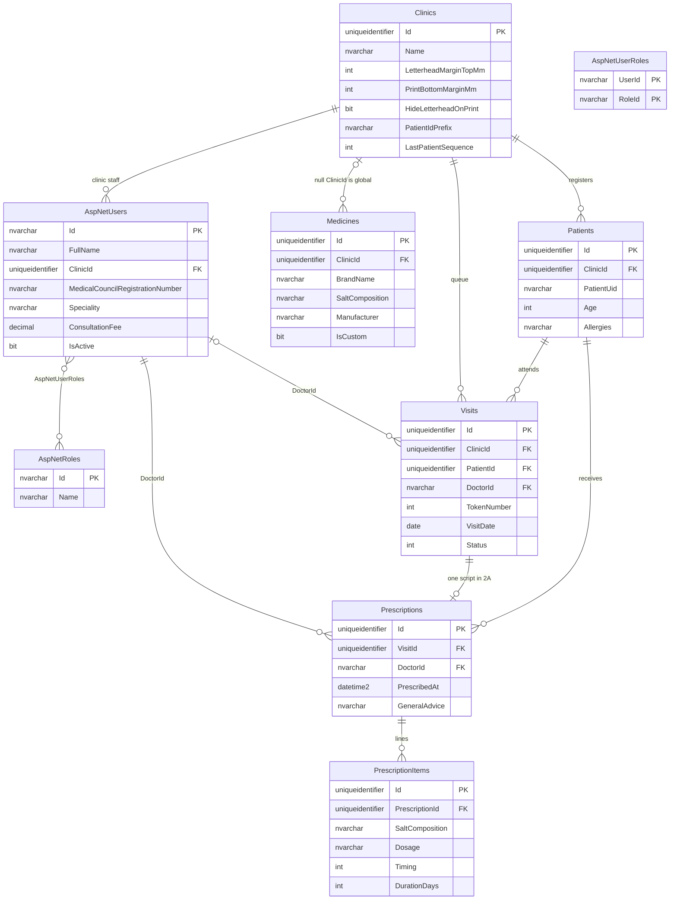
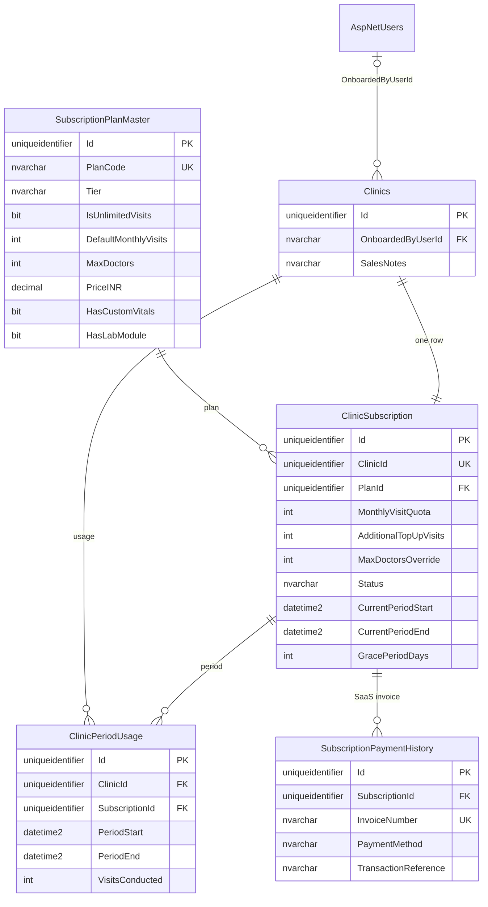
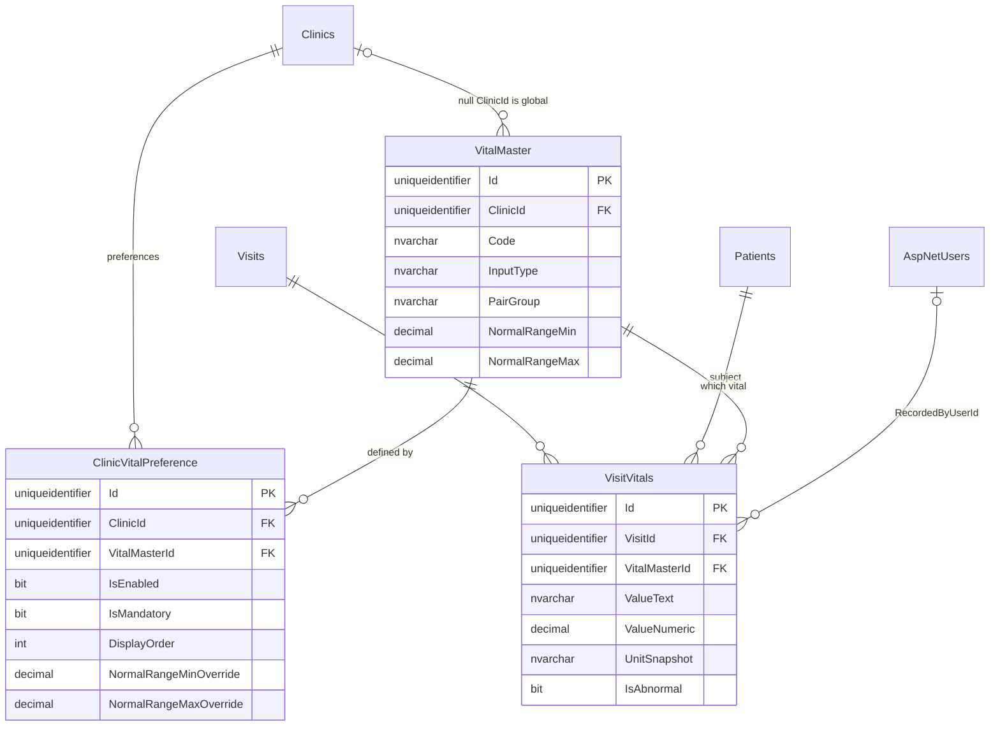
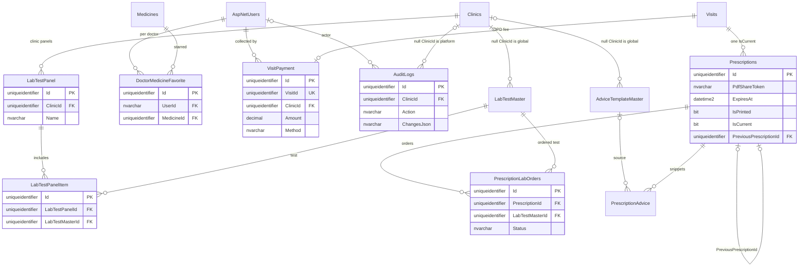

# DocOS — Phase 2 Database Schema

Schema for the four Phase 2 parts. The database is Microsoft SQL Server. Behavioral rules are in [DocOS-(Phase 2).md](<DocOS-(Phase 2).md>).

Phase 1’s PostgreSQL database is the historical MVP. These tables are created on a new SQL Server database.

---

## 1. Conventions

| Concern | SQL Server |
| :--- | :--- |
| Identifiers on domain entities | `uniqueidentifier` (`BaseEntity.Id`) |
| Identity user and role ids | `nvarchar(450)` (`AspNetUsers.Id`, `AspNetRoles.Id`) |
| Doctor foreign keys | `nvarchar(450)` to `AspNetUsers.Id` |
| Date and time | `datetime2` |
| Calendar day for tokens | `date` |
| Strings | `nvarchar` |
| Money and fees | `decimal(10,2)` |
| Vital numbers | `decimal(12,4)` |
| Booleans | `bit` |
| Migrations | `DocOS.Infrastructure/Migrations` only |

`BaseEntity` on domain tables: `Id` `uniqueidentifier` not null, `CreatedAt` `datetime2` not null, `UpdatedAt` `datetime2` null. Column lists below include those three unless the table is an Identity table or a pure join.

**Nullable `ClinicId` means different things on different tables.**

| Table | Null `ClinicId` |
| :--- | :--- |
| `AspNetUsers` | Only `PlatformAdmin` and `SalesAgent`. Clinic staff always have a clinic. |
| `Medicines` | Global Indian formulary row. Non-null means a clinic-custom medicine. |
| `VitalMaster` (2C) | Global vital definition. |
| `LabTestMaster`, `AdviceTemplateMaster` (2D) | Global catalog row. |
| `AuditLogs` (2D) | Platform action, not a clinic action. |

There is no SQL Server row-level security. Clinic isolation is the application guard: clinic-scoped commands refuse a caller with null `ClinicId` and filter by the caller’s clinic.

### Which part adds which table

| Table or change | Part |
| :--- | :--- |
| Activate `AspNetRoles` / `AspNetUserRoles`; user profile columns; drop `Role` | 2A |
| Clinic print and timings columns; drop doctor identity columns from `Clinics` | 2A |
| `Visits.DoctorId`, `Prescriptions.DoctorId`, token unique index | 2A |
| `Clinics.OnboardedByUserId`, `Clinics.SalesNotes` | 2B |
| `SubscriptionPlanMaster`, `ClinicSubscription`, `ClinicPeriodUsage`, `SubscriptionPaymentHistory` | 2B |
| `VitalMaster`, `ClinicVitalPreference`, `VisitVitals`; drop visit vital columns | 2C |
| Labs, panels, advice, favorites, `VisitPayment`, share token, revisions, `AuditLogs` | 2D |

---

## 2. Columns that stay until a later part

Through **2A and 2B**, `Visits` still stores vitals as columns. Part **2C** copies them into `VisitVitals` and then drops them.

| Column | SQL type | Notes |
| :--- | :--- | :--- |
| `SystolicBp` | `int` null | mmHg |
| `DiastolicBp` | `int` null | mmHg |
| `PulseBpm` | `int` null | bpm |
| `TemperatureF` | `decimal(12,4)` null | Fahrenheit |
| `Spo2` | `int` null | percent |
| `WeightKg` | `decimal(12,4)` null | kg |
| `HeightCm` | `decimal(12,4)` null | cm |
| `Bmi` | `decimal(12,4)` null | stored value; 2C treats BMI as computed |
| `Sugar` | `nvarchar(100)` null | free text, for example `140 PP` |

These also stay for the whole of Phase 2:

- `Visits.ChiefComplaints` free text.
- `Prescriptions.GeneralAdvice` optional free text.
- `PrescriptionItems.SaltComposition`, `Dosage` (`nvarchar`), `Timing` (existing `DosageTiming` enum, stored as `int`), `DurationDays` (`int`).
- `Clinics.PatientIdPrefix` and `Clinics.LastPatientSequence`.
- `Medicines.Manufacturer` and `Medicines.SaltComposition`.
- `PrescriptionItems` has no required `MedicineId`. Print uses the snapshot columns.

Phase 1 enums stay `int`: `Gender` (`Male`, `Female`, `Other`), `VisitStatus` (`Waiting`, `InConsultation`, `Completed`, `Cancelled`), `DosageForm` (`Tablet`, `Capsule`, `Syrup`, `Injection`, `Ointment`, `Drops`, `Inhaler`, `Powder`, `Lotion`, `Other`), `DosageTiming` (`AfterFood`, `BeforeFood`, `WithFood`, `Bedtime`, `EmptyStomach`).

---

## 3. Part 2A — Identity and multi-doctor

### 3.1 ERD

`AspNetUsers.ClinicId` is null only for PlatformAdmin and SalesAgent. `Medicines.ClinicId` null is the shared formulary. Visit vital columns from section 2 still sit on `Visits` in this part; they are not separate tables yet.

### 3.2 Identity

Standard Identity tables created by EF, not custom-designed in 2A: `AspNetRoleClaims`, `AspNetUserClaims`, `AspNetUserLogins`, `AspNetUserTokens`.

**`AspNetRoles`.** Seed only these `Name` values: `PlatformAdmin`, `SalesAgent`, `ClinicAdmin`, `Doctor`, `Nurse`, `Receptionist`.

| Column | Type | Null | Notes |
| :--- | :--- | :---: | :--- |
| `Id` | `nvarchar(450)` | No | PK |
| `Name` | `nvarchar(256)` | No | Unique |
| `NormalizedName` | `nvarchar(256)` | No | Unique |
| `ConcurrencyStamp` | `nvarchar(max)` | Yes | Identity |

**`AspNetUserRoles`.** Composite PK `(UserId, RoleId)`.

| Column | Type | Null | Notes |
| :--- | :--- | :---: | :--- |
| `UserId` | `nvarchar(450)` | No | FK `AspNetUsers(Id)` |
| `RoleId` | `nvarchar(450)` | No | FK `AspNetRoles(Id)` |

**`AspNetUsers` (`ApplicationUser`).** Identity’s own columns (`UserName`, `Email`, `PasswordHash`, `SecurityStamp`, and the rest of `IdentityUser`) stay. Phase 2 custom columns:

| Column | Type | Null | Notes |
| :--- | :--- | :---: | :--- |
| `Id` | `nvarchar(450)` | No | PK, Identity string |
| `FullName` | `nvarchar(150)` | No | Display name; doctor name on the letterhead |
| `ClinicId` | `uniqueidentifier` | Yes | FK `Clinics(Id)`. Null only for PlatformAdmin and SalesAgent |
| `Qualifications` | `nvarchar(200)` | Yes | For example `MBBS, MD (Medicine)` |
| `MedicalCouncilRegistrationNumber` | `nvarchar(100)` | Yes | Replaces clinic `RegNumber` |
| `Speciality` | `nvarchar(100)` | Yes | Replaces clinic `Specialization` |
| `ConsultationFee` | `decimal(10,2)` | Yes | Doctor fee. Null for non-doctors |
| `IsActive` | `bit` | No | Default 1. Deactivate does not delete the row |
| `CreatedAt` | `datetime2` | No | |

Dropped in 2A: `Role` (`nvarchar`).

### 3.3 `Clinics`

| Column | Type | Null | Notes |
| :--- | :--- | :---: | :--- |
| `Id` | `uniqueidentifier` | No | PK |
| `Name` | `nvarchar(200)` | No | Trade name |
| `Phone` | `nvarchar(20)` | No | |
| `Email` | `nvarchar(256)` | Yes | |
| `Address` | `nvarchar(500)` | Yes | |
| `LogoUrl` | `nvarchar(500)` | Yes | Blank-paper letterhead |
| `LetterheadMarginTopMm` | `int` | No | Default 60 |
| `PrintBottomMarginMm` | `int` | No | Default 0. Added in 2A |
| `HideLetterheadOnPrint` | `bit` | No | Default 0. Added in 2A. 0 draws the digital letterhead; 1 hides it for a pre-printed pad |
| `ClinicTimings` | `nvarchar(200)` | Yes | Added in 2A |
| `PatientIdPrefix` | `nvarchar(20)` | No | Default `DOC` |
| `LastPatientSequence` | `int` | No | Default 0 |
| `CreatedAt` | `datetime2` | No | |
| `UpdatedAt` | `datetime2` | Yes | |

Dropped in 2A: `DoctorName`, `RegNumber`, `Qualifications`, `Specialization`.

Not on this table in any Phase 2 part: `Status`, `SubscriptionTier`, `SubscriptionExpiresAt`, `MaxDoctorsAllowed`, `Subdomain`, `HfrId`, `EnableAbdmIntegration`.

### 3.4 `Patients`

Unchanged from Phase 1. Unique `(ClinicId, PatientUid)`.

| Column | Type | Null | Notes |
| :--- | :--- | :---: | :--- |
| `Id` | `uniqueidentifier` | No | PK |
| `ClinicId` | `uniqueidentifier` | No | FK `Clinics(Id)` |
| `PatientUid` | `nvarchar(50)` | No | Built from prefix and sequence |
| `FullName` | `nvarchar(150)` | No | |
| `Age` | `int` | No | No date-of-birth column |
| `Gender` | `int` | No | `Gender` enum |
| `MobileNumber` | `nvarchar(20)` | No | |
| `Email` | `nvarchar(256)` | Yes | |
| `BloodGroup` | `nvarchar(10)` | Yes | |
| `Address` | `nvarchar(300)` | Yes | |
| `Allergies` | `nvarchar(500)` | Yes | Allergy banner |
| `MedicalHistory` | `nvarchar(max)` | Yes | |
| `CreatedAt` | `datetime2` | No | |
| `UpdatedAt` | `datetime2` | Yes | |

### 3.5 `Visits`

Vital columns from section 2 remain on this table until 2C. Clinical columns stay.

| Column | Type | Null | Notes |
| :--- | :--- | :---: | :--- |
| `Id` | `uniqueidentifier` | No | PK |
| `ClinicId` | `uniqueidentifier` | No | FK `Clinics(Id)` |
| `PatientId` | `uniqueidentifier` | No | FK `Patients(Id)` |
| `DoctorId` | `nvarchar(450)` | Yes | FK `AspNetUsers(Id)`. Set at check-in. Required before `InConsultation` |
| `TokenNumber` | `int` | No | Sequence for that doctor that day |
| `VisitDate` | `date` | No | Calendar day of the queue. Phase 1 stored a timestamp; 2A stores the day so the token index is per day. Check-in time remains `CreatedAt` |
| `Status` | `int` | No | `VisitStatus`. Default `Waiting` |
| `ChiefComplaints` | `nvarchar(max)` | Yes | Free text |
| `Diagnosis` | `nvarchar(500)` | Yes | |
| `ClinicalNotes` | `nvarchar(max)` | Yes | |
| `FollowUpDate` | `datetime2` | Yes | |
| `CreatedAt` | `datetime2` | No | Check-in timestamp |
| `UpdatedAt` | `datetime2` | Yes | |

Plus the nine vital columns in section 2 until 2C.

Unique index `(ClinicId, DoctorId, VisitDate, TokenNumber)` filtered to `DoctorId IS NOT NULL`. Queue lookup index `(ClinicId, VisitDate, DoctorId, Status)`.

### 3.6 `Prescriptions`

| Column | Type | Null | Notes |
| :--- | :--- | :---: | :--- |
| `Id` | `uniqueidentifier` | No | PK |
| `VisitId` | `uniqueidentifier` | No | FK `Visits(Id)`. Unique in 2A (one script per visit). 2D changes this to one current revision |
| `PatientId` | `uniqueidentifier` | No | FK `Patients(Id)` |
| `ClinicId` | `uniqueidentifier` | No | FK `Clinics(Id)` |
| `DoctorId` | `nvarchar(450)` | No | FK `AspNetUsers(Id)`. Required once the consult is saved. Same user as `Visits.DoctorId` |
| `PrescribedAt` | `datetime2` | No | |
| `GeneralAdvice` | `nvarchar(max)` | Yes | Stays through Phase 2 |
| `CreatedAt` | `datetime2` | No | |
| `UpdatedAt` | `datetime2` | Yes | |

### 3.7 `PrescriptionItems`

| Column | Type | Null | Notes |
| :--- | :--- | :---: | :--- |
| `Id` | `uniqueidentifier` | No | PK |
| `PrescriptionId` | `uniqueidentifier` | No | FK `Prescriptions(Id)` |
| `MedicineName` | `nvarchar(200)` | No | Brand snapshot |
| `SaltComposition` | `nvarchar(300)` | No | Salt snapshot. Name stays `SaltComposition` |
| `Form` | `int` | No | `DosageForm` |
| `Dosage` | `nvarchar(50)` | No | Shorthand such as `1-0-1`, `SOS` |
| `Timing` | `int` | No | `DosageTiming` |
| `DurationDays` | `int` | No | Default 5 |
| `Instructions` | `nvarchar(300)` | Yes | |
| `CreatedAt` | `datetime2` | No | |
| `UpdatedAt` | `datetime2` | Yes | |

### 3.8 `Medicines`

| Column | Type | Null | Notes |
| :--- | :--- | :---: | :--- |
| `Id` | `uniqueidentifier` | No | PK |
| `ClinicId` | `uniqueidentifier` | Yes | FK `Clinics(Id)`. Null = global formulary |
| `BrandName` | `nvarchar(200)` | No | |
| `SaltComposition` | `nvarchar(300)` | No | |
| `Form` | `int` | No | `DosageForm` |
| `Strength` | `nvarchar(100)` | No | |
| `Manufacturer` | `nvarchar(150)` | Yes | |
| `IsCustom` | `bit` | No | Default 0 |
| `CreatedAt` | `datetime2` | No | |
| `UpdatedAt` | `datetime2` | Yes | |

Search returns rows where `ClinicId` is null or `ClinicId` equals the caller’s clinic. Index `(ClinicId, BrandName)`.

---

## 4. Part 2B — Onboarding and entitlements

2A tables remain. This part adds the subscription set and two clinic columns.

### 4.1 ERD

### 4.2 Columns added to `Clinics`

| Column | Type | Null | Notes |
| :--- | :--- | :---: | :--- |
| `OnboardedByUserId` | `nvarchar(450)` | Yes | FK `AspNetUsers(Id)`. SalesAgent lists filter on this |
| `SalesNotes` | `nvarchar(500)` | Yes | |

### 4.3 `SubscriptionPlanMaster`

| Column | Type | Null | Notes |
| :--- | :--- | :---: | :--- |
| `Id` | `uniqueidentifier` | No | PK |
| `PlanCode` | `nvarchar(50)` | No | Unique |
| `PlanName` | `nvarchar(150)` | No | |
| `Tier` | `nvarchar(30)` | No | `Starter`, `MultiDoctor`, `Enterprise` |
| `IsUnlimitedVisits` | `bit` | No | Default 0 |
| `DefaultMonthlyVisits` | `int` | Yes | Null when unlimited |
| `MaxDoctors` | `int` | No | Plan cap |
| `MaxStaff` | `int` | No | |
| `PriceINR` | `decimal(10,2)` | No | |
| `BillingCycle` | `nvarchar(20)` | No | `Monthly`, `Quarterly`, `Annual` |
| `HasCustomVitals` | `bit` | No | Feature arrives in 2C |
| `HasLabModule` | `bit` | No | Feature arrives in 2D |
| `IsActive` | `bit` | No | Default 1 |
| `CreatedAt` | `datetime2` | No | |
| `UpdatedAt` | `datetime2` | Yes | |

### 4.4 `ClinicSubscription`

One row per clinic. Lifecycle status lives here. A clinic created in 2A receives this row when 2B is applied.

| Column | Type | Null | Notes |
| :--- | :--- | :---: | :--- |
| `Id` | `uniqueidentifier` | No | PK |
| `ClinicId` | `uniqueidentifier` | No | Unique FK `Clinics(Id)` |
| `PlanId` | `uniqueidentifier` | No | FK `SubscriptionPlanMaster(Id)` |
| `IsUnlimitedVisits` | `bit` | No | PlatformAdmin override |
| `MonthlyVisitQuota` | `int` | Yes | Null when this clinic is unlimited |
| `AdditionalTopUpVisits` | `int` | No | Default 0. Current period only |
| `MaxDoctorsOverride` | `int` | Yes | Null means use the plan’s `MaxDoctors` |
| `Status` | `nvarchar(30)` | No | `Trial`, `Active`, `GracePeriod`, `QuotaExceeded`, `Suspended` |
| `CurrentPeriodStart` | `datetime2` | No | |
| `CurrentPeriodEnd` | `datetime2` | No | |
| `GracePeriodDays` | `int` | No | Default 5 |
| `Notes` | `nvarchar(500)` | Yes | |
| `CreatedAt` | `datetime2` | No | |
| `UpdatedAt` | `datetime2` | Yes | |

`TotalAllowed` is unlimited when `IsUnlimitedVisits` is true, otherwise `MonthlyVisitQuota + AdditionalTopUpVisits`. The extra 20 completed visits are a buffer beyond `TotalAllowed`, not a stored column.

### 4.5 `ClinicPeriodUsage`

Counts completed visits inside the subscription period. There is no `YearMonth` column.

| Column | Type | Null | Notes |
| :--- | :--- | :---: | :--- |
| `Id` | `uniqueidentifier` | No | PK |
| `ClinicId` | `uniqueidentifier` | No | FK `Clinics(Id)` |
| `SubscriptionId` | `uniqueidentifier` | No | FK `ClinicSubscription(Id)` |
| `PeriodStart` | `datetime2` | No | Matches the subscription period |
| `PeriodEnd` | `datetime2` | No | |
| `VisitsConducted` | `int` | No | Default 0. +1 when a visit first becomes `Completed` |
| `LastVisitRecordedAt` | `datetime2` | Yes | |
| `CreatedAt` | `datetime2` | No | |
| `UpdatedAt` | `datetime2` | Yes | |

Unique `(ClinicId, PeriodStart)`.

### 4.6 `SubscriptionPaymentHistory`

SaaS invoices from the platform to the clinic.

| Column | Type | Null | Notes |
| :--- | :--- | :---: | :--- |
| `Id` | `uniqueidentifier` | No | PK |
| `ClinicId` | `uniqueidentifier` | No | FK `Clinics(Id)` |
| `SubscriptionId` | `uniqueidentifier` | No | FK `ClinicSubscription(Id)` |
| `InvoiceNumber` | `nvarchar(50)` | No | Unique |
| `Amount` | `decimal(10,2)` | No | |
| `PaymentMethod` | `nvarchar(20)` | No | `UPI`, `Card`, `NetBanking`, `Cash`, `Cheque` |
| `TransactionReference` | `nvarchar(100)` | Yes | UTR or gateway reference |
| `PaymentDate` | `datetime2` | No | |
| `Status` | `nvarchar(20)` | No | `Success`, `Pending`, `Failed` |
| `CreatedAt` | `datetime2` | No | |
| `UpdatedAt` | `datetime2` | Yes | |

---

## 5. Part 2C — Dynamic vitals

### 5.1 ERD

### 5.2 `VitalMaster`

| Column | Type | Null | Notes |
| :--- | :--- | :---: | :--- |
| `Id` | `uniqueidentifier` | No | PK |
| `ClinicId` | `uniqueidentifier` | Yes | FK `Clinics(Id)`. Null = global |
| `Code` | `nvarchar(50)` | No | See seed codes below |
| `DisplayName` | `nvarchar(100)` | No | |
| `Unit` | `nvarchar(30)` | No | For example `mmHg`, `°F` |
| `InputType` | `nvarchar(20)` | No | `Number`, `Decimal`, `Text`, `Select`, `Computed`, `Paired` |
| `PairGroup` | `nvarchar(50)` | Yes | Shared by paired codes. `BP` for `BP_SYS` and `BP_DIA` |
| `NormalRangeMin` | `decimal(12,4)` | Yes | |
| `NormalRangeMax` | `decimal(12,4)` | Yes | |
| `DefaultDisplayOrder` | `int` | No | Default 0 |
| `IsActive` | `bit` | No | Default 1 |
| `CreatedAt` | `datetime2` | No | |
| `UpdatedAt` | `datetime2` | Yes | |

`Code` is unique among global rows (`ClinicId` null) and unique per clinic among custom rows.

Seed at least:

| Code | InputType | PairGroup | Source column |
| :--- | :--- | :--- | :--- |
| `BP_SYS` | `Paired` | `BP` | `SystolicBp` |
| `BP_DIA` | `Paired` | `BP` | `DiastolicBp` |
| `PULSE` | `Number` | | `PulseBpm` |
| `TEMP_F` | `Decimal` | | `TemperatureF` |
| `SPO2` | `Number` | | `Spo2` |
| `WEIGHT` | `Decimal` | | `WeightKg` |
| `HEIGHT` | `Decimal` | | `HeightCm` |
| `BMI` | `Computed` | | `Bmi` |
| `SUGAR` | `Text` | | `Sugar` |

### 5.3 `ClinicVitalPreference`

| Column | Type | Null | Notes |
| :--- | :--- | :---: | :--- |
| `Id` | `uniqueidentifier` | No | PK |
| `ClinicId` | `uniqueidentifier` | No | FK `Clinics(Id)` |
| `VitalMasterId` | `uniqueidentifier` | No | FK `VitalMaster(Id)` |
| `IsEnabled` | `bit` | No | Default 1 |
| `IsMandatory` | `bit` | No | Default 0 |
| `DisplayOrder` | `int` | No | Default 0 |
| `NormalRangeMinOverride` | `decimal(12,4)` | Yes | Null uses the master minimum |
| `NormalRangeMaxOverride` | `decimal(12,4)` | Yes | Null uses the master maximum |
| `CreatedAt` | `datetime2` | No | |
| `UpdatedAt` | `datetime2` | Yes | |

Unique `(ClinicId, VitalMasterId)`.

### 5.4 `VisitVitals`

| Column | Type | Null | Notes |
| :--- | :--- | :---: | :--- |
| `Id` | `uniqueidentifier` | No | PK |
| `VisitId` | `uniqueidentifier` | No | FK `Visits(Id)` |
| `PatientId` | `uniqueidentifier` | No | FK `Patients(Id)` |
| `VitalMasterId` | `uniqueidentifier` | No | FK `VitalMaster(Id)` |
| `ValueText` | `nvarchar(100)` | No | Display snapshot, including sugar text |
| `ValueNumeric` | `decimal(12,4)` | Yes | Required for `Number`, `Decimal`, and `Computed` |
| `UnitSnapshot` | `nvarchar(30)` | No | Unit at record time |
| `IsAbnormal` | `bit` | No | Default 0. Compared with the effective range |
| `RecordedAt` | `datetime2` | No | |
| `RecordedByUserId` | `nvarchar(450)` | Yes | FK `AspNetUsers(Id)`. Null is allowed on rows backfilled from Phase 1 columns |
| `CreatedAt` | `datetime2` | No | |
| `UpdatedAt` | `datetime2` | Yes | |

Index `(VisitId, VitalMasterId)`.

### 5.5 Visit columns after 2C

After the backfill, print and queue read `VisitVitals`, writers stop using the nine vital columns, and those columns are dropped. `ChiefComplaints` and the other clinical columns stay.

---

## 6. Part 2D — Labs, advice, payments, audit, favorites

### 6.1 ERD

### 6.2 `LabTestMaster`

| Column | Type | Null | Notes |
| :--- | :--- | :---: | :--- |
| `Id` | `uniqueidentifier` | No | PK |
| `ClinicId` | `uniqueidentifier` | Yes | FK `Clinics(Id)`. Null = global |
| `TestCode` | `nvarchar(50)` | No | Unique in the same scope as vital codes |
| `TestName` | `nvarchar(150)` | No | |
| `Category` | `nvarchar(50)` | No | For example Hematology, Biochemistry |
| `SampleType` | `nvarchar(50)` | Yes | |
| `FastingRequired` | `bit` | No | Default 0 |
| `IsActive` | `bit` | No | Default 1 |
| `CreatedAt` | `datetime2` | No | |
| `UpdatedAt` | `datetime2` | Yes | |

### 6.3 `LabTestPanel` and `LabTestPanelItem`

Panels belong to one clinic.

**`LabTestPanel`**

| Column | Type | Null | Notes |
| :--- | :--- | :---: | :--- |
| `Id` | `uniqueidentifier` | No | PK |
| `ClinicId` | `uniqueidentifier` | No | FK `Clinics(Id)` |
| `Name` | `nvarchar(150)` | No | For example Fever Panel |
| `IsActive` | `bit` | No | Default 1 |
| `CreatedAt` | `datetime2` | No | |
| `UpdatedAt` | `datetime2` | Yes | |

**`LabTestPanelItem`**

| Column | Type | Null | Notes |
| :--- | :--- | :---: | :--- |
| `Id` | `uniqueidentifier` | No | PK |
| `LabTestPanelId` | `uniqueidentifier` | No | FK `LabTestPanel(Id)` |
| `LabTestMasterId` | `uniqueidentifier` | No | FK `LabTestMaster(Id)` |
| `DisplayOrder` | `int` | No | Default 0 |
| `CreatedAt` | `datetime2` | No | |
| `UpdatedAt` | `datetime2` | Yes | |

Unique `(LabTestPanelId, LabTestMasterId)`.

### 6.4 `PrescriptionLabOrders`

| Column | Type | Null | Notes |
| :--- | :--- | :---: | :--- |
| `Id` | `uniqueidentifier` | No | PK |
| `PrescriptionId` | `uniqueidentifier` | No | FK `Prescriptions(Id)` |
| `LabTestMasterId` | `uniqueidentifier` | No | FK `LabTestMaster(Id)` |
| `SpecialInstructions` | `nvarchar(300)` | Yes | |
| `Status` | `nvarchar(20)` | No | `Ordered`, `Completed`. Default `Ordered` |
| `CreatedAt` | `datetime2` | No | |
| `UpdatedAt` | `datetime2` | Yes | |

A panel order expands into one row per test. The panel id is not stored on the order.

### 6.5 `AdviceTemplateMaster` and `PrescriptionAdvice`

**`AdviceTemplateMaster`**

| Column | Type | Null | Notes |
| :--- | :--- | :---: | :--- |
| `Id` | `uniqueidentifier` | No | PK |
| `ClinicId` | `uniqueidentifier` | Yes | FK `Clinics(Id)`. Null = global |
| `Category` | `nvarchar(50)` | No | |
| `Title` | `nvarchar(150)` | No | |
| `InstructionsText` | `nvarchar(max)` | No | |
| `IsActive` | `bit` | No | Default 1 |
| `CreatedAt` | `datetime2` | No | |
| `UpdatedAt` | `datetime2` | Yes | |

**`PrescriptionAdvice`**

| Column | Type | Null | Notes |
| :--- | :--- | :---: | :--- |
| `Id` | `uniqueidentifier` | No | PK |
| `PrescriptionId` | `uniqueidentifier` | No | FK `Prescriptions(Id)` |
| `AdviceTemplateId` | `uniqueidentifier` | Yes | FK `AdviceTemplateMaster(Id)` |
| `AdviceText` | `nvarchar(max)` | No | Snapshot copied at selection time |
| `DisplayOrder` | `int` | No | Default 0 |
| `CreatedAt` | `datetime2` | No | |
| `UpdatedAt` | `datetime2` | Yes | |

`Prescriptions.GeneralAdvice` remains.

### 6.6 `DoctorMedicineFavorite`

| Column | Type | Null | Notes |
| :--- | :--- | :---: | :--- |
| `Id` | `uniqueidentifier` | No | PK |
| `UserId` | `nvarchar(450)` | No | FK `AspNetUsers(Id)` |
| `MedicineId` | `uniqueidentifier` | No | FK `Medicines(Id)` |
| `CreatedAt` | `datetime2` | No | |
| `UpdatedAt` | `datetime2` | Yes | |

Unique `(UserId, MedicineId)`.

### 6.7 Optional columns on `Medicines`

| Column | Type | Null | Notes |
| :--- | :--- | :---: | :--- |
| `DefaultDosage` | `nvarchar(50)` | Yes | Prefill only |
| `DefaultTiming` | `int` | Yes | `DosageTiming`. Prefill only |

The prescription line still stores `Dosage` and `Timing`.

### 6.8 Columns added to `Prescriptions`

| Column | Type | Null | Notes |
| :--- | :--- | :---: | :--- |
| `PdfShareToken` | `nvarchar(128)` | Yes | Unique where not null. At least 128 bits of entropy |
| `ExpiresAt` | `datetime2` | Yes | Required when `PdfShareToken` is set |
| `IsPrinted` | `bit` | No | Default 0 |
| `PreviousPrescriptionId` | `uniqueidentifier` | Yes | FK `Prescriptions(Id)`. Set on the new row |
| `IsCurrent` | `bit` | No | Default 1. The visit’s live script |

Replace the 2A unique index on `VisitId` with a filtered unique index on `VisitId` where `IsCurrent = 1`.

Once `IsPrinted` is true, or a `PRINT` audit exists for that row, an edit inserts a new current row and leaves the printed row unchanged.

### 6.9 `VisitPayment`

OPD fee collected at the clinic. Separate from `SubscriptionPaymentHistory`.

| Column | Type | Null | Notes |
| :--- | :--- | :---: | :--- |
| `Id` | `uniqueidentifier` | No | PK |
| `VisitId` | `uniqueidentifier` | No | Unique FK `Visits(Id)` |
| `ClinicId` | `uniqueidentifier` | No | FK `Clinics(Id)` |
| `Amount` | `decimal(10,2)` | No | |
| `Method` | `nvarchar(20)` | No | `Cash`, `UPI` |
| `Reference` | `nvarchar(100)` | Yes | UPI reference when used |
| `CollectedByUserId` | `nvarchar(450)` | No | FK `AspNetUsers(Id)` |
| `CollectedAt` | `datetime2` | No | |
| `CreatedAt` | `datetime2` | No | |
| `UpdatedAt` | `datetime2` | Yes | |

Index `(ClinicId, CollectedAt)` for the daily report.

### 6.10 `AuditLogs`

Ordinary table. `ChangesJson` is a normal column, not a hash chain or ledger.

| Column | Type | Null | Notes |
| :--- | :--- | :---: | :--- |
| `Id` | `uniqueidentifier` | No | PK |
| `ClinicId` | `uniqueidentifier` | Yes | FK `Clinics(Id)`. Null for platform actions |
| `UserId` | `nvarchar(450)` | Yes | FK `AspNetUsers(Id)` |
| `Action` | `nvarchar(20)` | No | `CREATE`, `UPDATE`, `DELETE`, `LOGIN`, `PRINT` |
| `EntityName` | `nvarchar(100)` | No | |
| `EntityId` | `nvarchar(100)` | No | |
| `Timestamp` | `datetime2` | No | |
| `IpAddress` | `nvarchar(50)` | Yes | |
| `ChangesJson` | `nvarchar(max)` | Yes | Before/after payload for support and review |

Index `(ClinicId, Timestamp)`. Do not write rows for routine queue views.

---

## 7. Not in this schema

One line each, so a later edit does not bring them back into Phase 2.

- `DatabaseProvider` switch, `UseNpgsql`, Supabase, and a second migration folder. Phase 2 is SQL Server only. Phase 1 PostgreSQL is not migrated in place.
- `Clinics.Status`, `Clinics.SubscriptionTier`, `Clinics.SubscriptionExpiresAt`, `Clinics.MaxDoctorsAllowed`. Lifecycle and caps are on `ClinicSubscription` (with `MaxDoctorsOverride`).
- `HasAbdmIntegration` on `SubscriptionPlanMaster`.
- `ClinicMonthlyUsage` and any `YearMonth` usage key. The counter table is `ClinicPeriodUsage`.
- `ComplaintMaster` and `VisitComplaints`.
- `DosageFrequencyMaster` and `DosageTimingMaster`.
- Pharmacist role in `AspNetRoles`.
- `IsDoctorFavorite` on `Medicines`. Favorites are `DoctorMedicineFavorite`.
- Renaming `SaltComposition` to `GenericName`.
- `DoctorId` as `uniqueidentifier`.
- `AbhaNumber`, `AbhaAddress`, `IsAbhaVerified`, `HfrId`, `HprId`, `EnableAbdmIntegration`.
- `Clinics.Subdomain` and wildcard-DNS tenant routing.
- A `VIEW` audit action for routine queue reads.
- WhatsApp or SMS delivery tables.
- A tamper-proof or hash-chained audit ledger.
